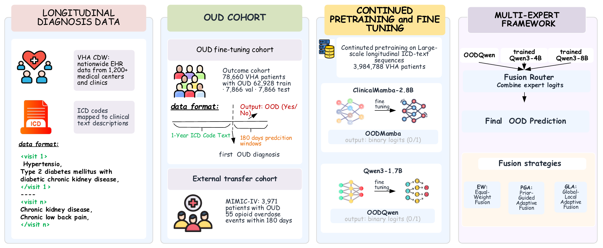

# Patient Timeline Pretraining, Fine-Tuning, and Logit MoE  for opoid overdose

This repository provides three stages for patient timeline modeling with Qwen3:

1. Continued pretraining with LoRA using LLaMA-Factory.
2. LoRA fine-tuning for binary classification.
3. Offline mixture-of-experts (MoE) evaluation using saved classification logits from three experts.

**All project demo data are synthetic.** The files in `0_pre_train/data/` contain fictional patient timelines, and `1_fine_tuning/mock_data_10.jsonl` contains artificial classification examples. They are intended for checking data formats and exercising the workflow. Results on these tiny examples do not measure clinical or out-of-distribution performance. The bundled LLaMA-Factory directory also contains upstream examples unrelated to this project.

## Framework overview

[](piture/framework.pdf)

*Figure: study framework. Click the image to open the original [PDF](piture/framework.pdf). The preview is cropped to the four framework panels for readability.*

The framework uses longitudinal diagnosis histories to predict opioid overdose (OOD) among patients with opioid use disorder (OUD). Here, **OOD in the figure means opioid overdose**; external transfer evaluates generalization to another cohort.

1. **Longitudinal diagnosis data.** ICD codes from the Veterans Health Administration Corporate Data Warehouse (VHA CDW) are mapped to clinical text descriptions and organized chronologically with visit boundaries.
2. **Cohort construction.** The figure describes an OUD outcome cohort of 78,660 VHA patients, divided into 62,928 training, 7,866 validation, and 7,866 test patients. One year of ICD text preceding the first OUD diagnosis provides the input for a 180-day overdose prediction window. The external MIMIC-IV cohort contains 3,971 patients with OUD and 55 overdose events within 180 days.
3. **Continued pretraining and fine-tuning.** The study diagram describes continued pretraining on longitudinal ICD-text sequences from 3,984,788 VHA patients, followed by binary classification fine-tuning. It shows ClinicalMamba-2.8B and Qwen3-1.7B branches, labeled OODMamba and OODQwen after fine-tuning.
4. **Multi-expert prediction.** The fusion panel combines OODQwen with trained Qwen3-4B and Qwen3-8B experts. A fusion router combines their binary logits using equal-weight (EW), prior-guided adaptive (PGA), or global-local adaptive (GLA) fusion to produce the final overdose prediction.

These cohort sizes describe the supplied study figure; the underlying study datasets and trained models are **not included**. This repository provides a synthetic-data Qwen3 implementation of the pretraining, classification, and logit-fusion workflow. It does not include a ClinicalMamba implementation or pretrained 4B/8B expert checkpoints.

| Framework component | Repository implementation |
| --- | --- |
| ICD-text continued pretraining | `0_pre_train/` — LLaMA-Factory LoRA pretraining |
| Binary outcome fine-tuning | `1_fine_tuning/` — Qwen3 sequence classification |
| Expert logit export | `2_logits_moe/save_logits.py` |
| EW fusion | `2_logits_moe/1_average_moe.py` |
| PGA fusion | `2_logits_moe/2_weighted_moe.py` |
| GLA fusion | `2_logits_moe/3_global_local_moe.py` |

## Repository layout

```text
0_pre_train/
  data/                             # Synthetic pretraining data and dataset registry
  prepare_patient_pretrain.py       # Generate demo data or convert your own records
  qwen3_lora_pretrain_demo.yaml      # Two-step LoRA pretraining configuration
  run_qwen3.sh                      # Data preparation and pretraining launcher
  sinmple.sh                        # Minimal pretraining launcher
  LLaMA-Factory/                    # Bundled upstream training framework
1_fine_tuning/
  model.py                          # Qwen3 sequence classifier with LoRA
  train.py                          # Binary classification training
  mock_data_10.jsonl                # Ten synthetic labeled records
  eval.py                           # Additional evaluation entry point
  analysis/                         # Supplementary analysis scripts
2_logits_moe/
  save_logits.py                    # Export one expert's aligned logits
  1_average_moe.py                  # Uniform averaging
  2_weighted_moe.py                 # Prior and entropy-adaptive weighting
  3_global_local_moe.py             # Validation quality and local entropy weighting
```

## English-only distribution

The bundled LLaMA-Factory source has been modified for this English-only distribution. Localized documents use their English counterparts, Chinese prompt text and comments have been translated, and interface entries containing Chinese characters fall back to English. Mixed-language demo datasets retain complete non-Chinese records; standalone Chinese demo datasets use the corresponding English examples. Existing filenames and locale keys are retained for compatibility. These changes also affect localized prompt behavior and demo dataset sizes. Upstream Git history and packaged binary dependencies are outside this text cleanup.

## Environment

Use Python 3.11 or newer, as required by the bundled LLaMA-Factory package. Training and logit export require CUDA; the model code loads weights in BF16, so use a GPU that supports BF16 and has sufficient memory. Fusion of saved logits runs on CPU.

Run the following from the repository root in a fresh environment with a CUDA-compatible PyTorch installation:

```bash
python -m venv .venv
source .venv/bin/activate
python -m pip install -e ./0_pre_train/LLaMA-Factory
python -m pip install scikit-learn tqdm
```

The bundled package declares its dependencies in `0_pre_train/LLaMA-Factory/pyproject.toml`. Model downloads require access to the model repository; alternatively supply a local model directory. The offline installation scripts and wheel folders are environment-specific: some wheels target Python 3.10, and the bundled Transformers 4.52.4 wheel is below the framework's declared minimum of 4.55.0. Do not treat those archives as a complete installation for this environment.

## 1. Continued pretraining

### Prepare synthetic data

From the repository root:

```bash
python 0_pre_train/prepare_patient_pretrain.py
```

This writes six training records, two development records, raw demo files, and `dataset_info.json` under `0_pre_train/data/`. The training format is one JSON object per line:

```json
{"text": "P0001 <visit> Time: 0 months I10 | Essential hypertension."}
```

To convert your own data into a separate directory:

```bash
python 0_pre_train/prepare_patient_pretrain.py \
  --train-file /path/to/train.jsonl \
  --dev-file /path/to/dev.jsonl \
  --output-dir /path/to/pretrain_data
```

Both input paths must be supplied together. JSON, JSONL, and plain text are supported. Object records can use `text`, `patienrID` (the original example spelling), `patientID`, `patient_id`, `timeline`, `visit`, or `content`. The selected field must contain the timeline text. Generation overwrites the corresponding output files.

### Run the demo

```bash
cd 0_pre_train
PYTHON_BIN="$(command -v python)" GPU_IDS=0 DISABLE_VERSION_CHECK=0 \
  bash run_qwen3.sh
cd ..
```

The launcher defaults to `Qwen/Qwen3-1.7B` and writes to `0_pre_train/outputs/qwen3_1_7b_patient_lora_demo`. The YAML performs only **two optimizer steps**, with sequence length 256, LoRA rank 8, and BF16. It enables output-directory overwriting. Use a new output directory for each experiment.

Environment variables supported by the launcher include `MODEL_NAME_OR_PATH`, `GPU_IDS`, `TRAIN_FILE`, `DEV_FILE`, `OUTPUT_DIR`, and `PYTHON_BIN`. `GPU_IDS=0,1` selects two GPUs. `--prepare-only` converts data without loading a model; `--check-only` additionally checks runtime imports. Set `PYTHON_BIN` to use the active environment without the launcher's default `qwen3` conda activation.

For a converted dataset in another directory, invoke the CLI directly:

```bash
cd 0_pre_train
CUDA_VISIBLE_DEVICES=0 llamafactory-cli train qwen3_lora_pretrain_demo.yaml \
  dataset_dir=/path/to/pretrain_data \
  output_dir=outputs/my_pretrain_run
cd ..
```

For a substantive training run, adjust `max_steps`, sequence length, batch size, and other training settings in the YAML. The saved output is a **causal-language-model LoRA adapter**, not a standalone merged model.

## 2. Classification fine-tuning

The classification JSONL schema differs from the pretraining schema:

```json
{"icd": "I10 E11.9 E78.5", "label": "0"}
{"icd": "I21.3 I25.1 R07.9", "label": "1"}
```

Use string labels `"0"` and `"1"`; the current loader treats only the string `"1"` as positive. Include both classes in the training data because the sampler uses inverse class frequencies.

### Run the supplied demo

```bash
cd 1_fine_tuning
CUDA_VISIBLE_DEVICES=0 python train.py
cd ..
```

The default base model is `Qwen/Qwen3-1.7B`, configured by `MODEL_ID` in `model.py`. The script uses a maximum length of 2000, batch size 16, learning rate `2e-5`, up to 20 epochs, and LoRA rank 16 on `q_proj` and `v_proj`.

**The demo uses the same ten records for training and validation.** Before a real experiment, edit the two `get_data(...)` calls in `train.py` to point to independent training and validation JSONL files. Batch size, epochs, learning rate, and checkpoint directory are also configured in that script; it does not expose training CLI flags. Reduce batch size if GPU memory is insufficient.

An improved validation F1 above 0.10 triggers saving to `1_fine_tuning/checkpoints/`. A checkpoint is therefore not guaranteed on every run. The directory contains the classification adapter and its saved classification head; the base model is still needed for inference. Use a separate checkpoint directory for each expert.

### Optionally initialize from continued pretraining

By default, classification starts from the original Qwen model. To use stage 1, first merge its causal-LM adapter into the **same base model used for pretraining**. For example, create `0_pre_train/export_pretrain.yaml`:

```yaml
model_name_or_path: Qwen/Qwen3-1.7B
adapter_name_or_path: outputs/qwen3_1_7b_patient_lora_demo
finetuning_type: lora
template: qwen3
export_dir: outputs/qwen3_patient_merged
export_size: 5
export_device: cpu
export_legacy_format: false
```

Then export from `0_pre_train/`:

```bash
cd 0_pre_train
llamafactory-cli export export_pretrain.yaml
cd ..
```

Set `MODEL_ID` in `1_fine_tuning/model.py` to the absolute path of that merged model before running `train.py`. The sequence classifier initializes a classification head and trains a new classification LoRA adapter. Do not pass the pretraining adapter directly to the classification adapter loader.

## 3. Logit MoE

These scripts combine the outputs of **exactly three separately trained classification experts**. This is output-level fusion; there is no jointly trained sparse MoE layer. Supply three classification checkpoints and their matching base models. The repository does not include trained checkpoints.

### Export each expert

Run from the repository root. This single-expert example uses the synthetic classification data:

```bash
CUDA_VISIBLE_DEVICES=0 python 2_logits_moe/save_logits.py \
  --llm-path Qwen/Qwen3-1.7B \
  --checkpoint 1_fine_tuning/checkpoints \
  --data-file 1_fine_tuning/mock_data_10.jsonl \
  --output logits/expert1_test.pt \
  --batch-size 1
```

For a full experiment, export each of the three experts on the same validation file and the same independent test file. For example, if all three experts share the original Qwen base:

```bash
for expert in 1 2 3; do
  for split in validation test; do
    CUDA_VISIBLE_DEVICES=0 python 2_logits_moe/save_logits.py \
      --llm-path Qwen/Qwen3-1.7B \
      --checkpoint "/path/to/expert${expert}/checkpoints" \
      --data-file "/path/to/${split}.jsonl" \
      --output "logits/expert${expert}_${split}.pt"
  done
done
```

Replace the placeholder paths. If the experts use different base or merged models, run exports separately with each expert's matching `--llm-path`. This option also selects the tokenizer.

Each `.pt` file contains logits, labels, sample indices, a data fingerprint, and model metadata. Within each split, all experts must see identical records in identical order; the loader checks alignment. Keep expert ordering consistent between validation and test arguments. Select weights using validation data and report final results on held-out test data.

### Method 1: uniform averaging

```bash
python 2_logits_moe/1_average_moe.py \
  --test-logits logits/expert1_test.pt logits/expert2_test.pt logits/expert3_test.pt
```

### Method 2: prior and entropy-adaptive weighting

```bash
python 2_logits_moe/2_weighted_moe.py \
  --validation-logits logits/expert1_validation.pt logits/expert2_validation.pt logits/expert3_validation.pt \
  --test-logits logits/expert1_test.pt logits/expert2_test.pt logits/expert3_test.pt \
  --prior-weights 0.30 0.50 0.20 \
  --lambda-candidates 0.0 0.01 0.02 0.05 0.10 0.20 0.30 \
  --entropy-beta 1.0
```

Weights interpolate between the supplied prior and per-sample inverse-entropy weights. The interpolation parameter is selected by validation AUPRC. Prior weights must be nonnegative and sum to one; lambda candidates must lie in `[0, 1]` and include zero.

### Method 3: global quality and local entropy

```bash
python 2_logits_moe/3_global_local_moe.py \
  --validation-logits logits/expert1_validation.pt logits/expert2_validation.pt logits/expert3_validation.pt \
  --test-logits logits/expert1_test.pt logits/expert2_test.pt logits/expert3_test.pt \
  --alpha 1.0 --beta 1.0
```

Each expert's validation AUPRC supplies a global quality score. Per-sample prediction entropy supplies local uncertainty. Routing weights are `softmax(alpha * quality - beta * entropy)`. The script also reports an entropy-only baseline. Both parameters must be nonnegative.

The MoE scripts print evaluation metrics to standard output. They do not create or train a new model checkpoint.
